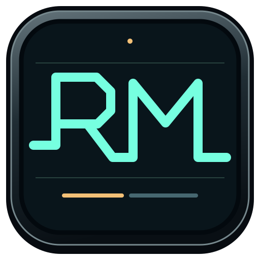
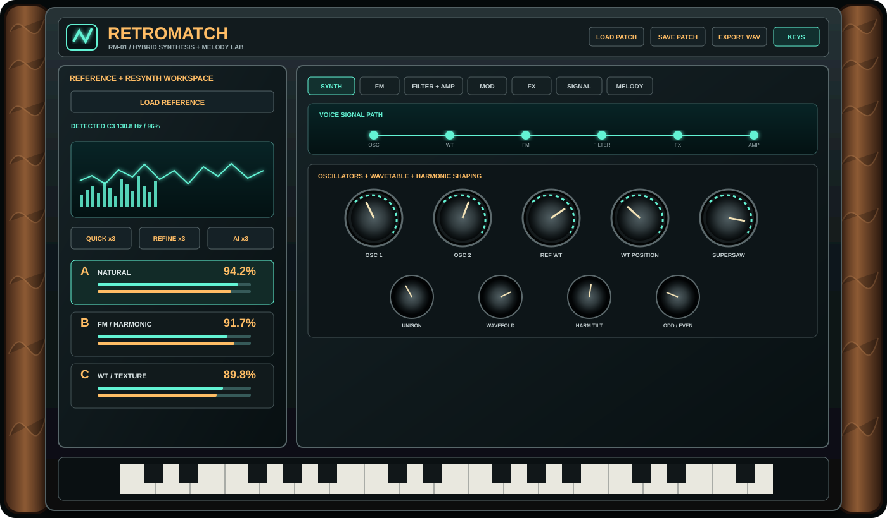
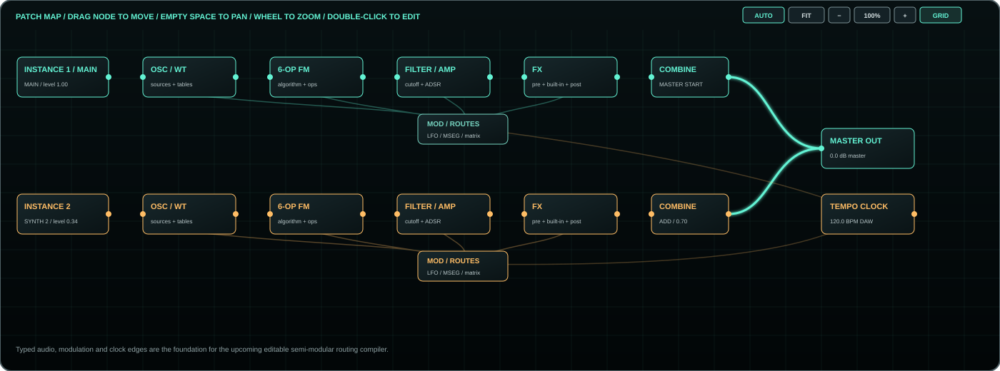

# RetroMatch Synth

<p align="center">
  
</p>

<p align="center"><strong>Sample-to-synth reconstruction as an editable VST3/AU instrument.</strong></p>

RetroMatch is a C++20/JUCE hybrid synthesizer that analyzes reference audio and reconstructs it as a **real editable synthesis patch**. It combines virtual analog, wavetable, reference-derived wavetable, additive, unison, phase modulation, six-operator FM, modulation, filtering and effects with a closed-loop renderer/analyzer/matcher.

The result is not a hidden sampler preset: oscillator topology, FM operators, envelopes, filters, modulation, layers, effects and the extracted wavetable material remain available for editing, automation and further sound design.

<p align="center">
  
</p>

> **Formats:** VST3, Audio Unit (macOS), Standalone  
> **Framework:** JUCE 9.0.1 / C++20 / CMake  
> **Platforms:** Windows 10/11 and macOS  
> **Development plan:** [`plan.md`](plan.md)

---

## What makes RetroMatch different

A normal spectrum analyzer tells you what is present; RetroMatch attempts to turn those measurements into a reusable instrument patch.

```text
Reference audio
      ↓
Region selection / cleanup
      ↓
Pitch + spectral + temporal + timbre analysis
      ↓
Feature-derived seed + reference wavetable extraction
      ↓
Offline synth rendering
      ↓
Perceptual comparison
      ↓
Evolution / topology-biased refinement
      ↓
Editable synth + layered patch
```

The matcher renders the **same SynthEngine used for live playback**, analyzes that render with the same feature path used for the source, scores the difference, and searches for a better candidate.

---

## Current highlights

### Reference editor for short sounds and full tracks

The reference workflow supports more than a tiny one-shot waveform. A large reference editor is available for:

- zoom and pan
- draggable start/end range
- move the selected region
- preview the selection
- normalize
- fade in / fade out
- cut the selection into a new reference
- choose a focused region for resynthesis
- choose a separate region for MIDI analysis

Long recordings can therefore be treated as source material rather than forcing the matcher to analyze an entire song as one timbre.

### Professional resynthesis modes

The current engine exposes strategy and complexity controls for deeper matching:

- **Balanced Hybrid**
- **Reference Wavetable**
- **Spectral Subtractive**
- **FM / Harmonic**
- **Layered Studio**
- **Texture / Chop**

Complexity can scale from the legacy compact patch to **4, 6 or 8 synthesis instances**, allowing complementary roles such as body, sub/foundation, air, motion, harmonic colour, width and texture instead of simply duplicating one sound.

### Reference-derived wavetable synthesis

RetroMatch extracts phase-stabilized periodic material from the selected reference region into morphable 2048-sample frames. The matcher can deliberately favor that source when it improves the match, and Texture/Chop-style workflows can derive more animated timbral material from the selected audio.

### Visual comparison

The large compare view can inspect reference vs resynthesis across waveform/envelope and spectral fingerprints, with score dimensions for spectrum, timbre, temporal behavior, harmonics, envelope, pitch and stereo image.

### Master gain staging

A dedicated **MASTER OUTPUT** control sits after the complete synth/reference mix so patches with very different internal gain structures can be auditioned and mixed consistently without destroying the patch's own output-gain design.

---

## Signal Lab and patch map

Signal Lab combines live output scope, spectrum, stereo field and a whole-synth patch map.

<p align="center">
  
</p>

The patch map is being expanded into a safe semi-modular playground. The current canvas foundation supports node navigation, pan/zoom, node dragging, snap-to-grid, auto arrange and fit/zoom controls. The next implementation stages add typed ports, editable cables and a validated DSP routing compiler so changing a connection changes the actual sound.

See [`plan.md`](plan.md) for the implementation order and safety/compatibility rules.

---

## Hybrid synthesis engine

RetroMatch deliberately uses several synthesis methods because a single architecture is not enough to reconstruct a broad set of sounds.

- two virtual-analog oscillators: sine, triangle, BLEP saw, square/pulse
- variable pulse width, sub oscillator, noise and ring modulation
- 12-partial additive layer
- factory wavetable engine with continuous frame interpolation and warp
- reference-derived wavetable bank
- seven-voice supersaw/unison with stereo spread
- phase modulation
- six-operator FM with multiple algorithms, ratio/fixed modes, per-operator ADSR, key scale and velocity
- wavefolder / nonlinear harmonic shaping
- multimode state-variable filter
- polyphonic amp ADSR
- LFO, MSEG and modulation graph
- modular + built-in effects
- multi-instance layered synthesis

---

## Main workflow

1. **Load Reference** — WAV, AIFF or FLAC, or drag a file onto the plug-in.
2. Open the large reference editor when the source needs a precise region or cleanup.
3. **Quick x3** builds three initial reconstruction candidates.
4. **Refine x3** runs closed-loop render/analyze/score optimization.
5. **AI x3** can request structured seed ideas from the configured provider and still score them locally.
6. Compare/select **A / B / C** or morph between the alternatives.
7. Edit synthesis, layers, modulation, FX and wavetable controls manually.
8. Save a self-contained `.rmsynth` patch or export audio/MIDI.

Reference-derived wavetable data is embedded in patch/session state so the original source file is not required for normal synth playback after extraction.

---

## Melody / MIDI extraction

Reference audio can also be analyzed into editable timed notes. Long-track transcription is chunked instead of silently stopping at the original short-analysis limit.

- predominant-melody mode
- experimental layered-note mode
- interactive piano roll
- replay through the current RetroMatch patch
- standard MIDI export with tempo metadata
- separate selection for MIDI vs timbre resynthesis

Mixed/mastered material is inherently ambiguous: drums, vocals, overlapping harmonics and effects can create missed or additional notes. MIDI extraction is therefore an editable estimate, not source separation.

---

## Closed-loop matching

The deeper matcher uses derivative-free population search because the patch contains both continuous values and discrete topology decisions.

It evaluates combinations of:

- global spectral shape
- temporal spectrum / RMS contour
- cepstral timbre descriptors
- brightness, bandwidth and flatness
- envelope and transient behavior
- harmonic / inharmonic character
- pitch
- stereo image

The optimizer retains strong candidates, mutates coarse-to-fine, crosses over parameter groups and respects Match Locks so already-convincing parts of a patch can be frozen while other groups continue evolving.

---

## Hardware-style UI

The custom JUCE interface follows an original RM-01 hardware language: dark machined metal, walnut cheeks, recessed panels/displays, illuminated controls and dense but direct instrument ergonomics. It is inspired by the workflow of professional hardware synthesizers without copying a specific manufacturer's protected panel design.

The interface includes dedicated pages for:

- Layers / Presets
- Synth
- FM
- Filter + Amp
- Modulation / MSEG
- FX
- Wavetable
- Settings / AI Log
- Signal Lab
- Melody / MIDI

---

## Building

Full setup and CI details are in [`docs/BUILD.md`](docs/BUILD.md).

### Windows

```powershell
Set-ExecutionPolicy -Scope Process Bypass
.\scripts\setup-windows.ps1
# reopen PowerShell if setup changed the toolchain
.\scripts\check-tools.ps1
.\scripts\build-windows.ps1 -RunTests
```

Expected artifacts:

```text
build-windows/RetroMatchSynth_artefacts/Release/VST3/RetroMatch Synth.vst3
build-windows/RetroMatchSynth_artefacts/Release/Standalone/RetroMatch Synth.exe
```

### macOS

```bash
chmod +x scripts/build-macos.sh
RUN_TESTS=1 ./scripts/build-macos.sh
```

Expected artifacts:

```text
build-macos/RetroMatchSynth_artefacts/Release/VST3/RetroMatch Synth.vst3
build-macos/RetroMatchSynth_artefacts/Release/AU/RetroMatch Synth.component
build-macos/RetroMatchSynth_artefacts/Release/Standalone/RetroMatch Synth.app
```

For an existing JUCE checkout, pass `-JuceDir C:\dev\JUCE` on Windows or configure with `-DRETROMATCH_JUCE_DIR=/path/to/JUCE`.

---

## Verification

Run the dependency-free source contract first:

```bash
python scripts/static-check.py
```

Then build with `RETROMATCH_BUILD_TESTS=ON` / the platform scripts and run the DSP smoke tests. Release validation should also include pluginval, at least two VST3 hosts, DAW automation/session recall and `auval` on macOS.

Relevant documents:

- [`docs/ARCHITECTURE.md`](docs/ARCHITECTURE.md)
- [`docs/BUILD.md`](docs/BUILD.md)
- [`docs/VERIFICATION.md`](docs/VERIFICATION.md)
- [`docs/ROADMAP.md`](docs/ROADMAP.md)
- [`plan.md`](plan.md) — active implementation plan

---

## Core design principles

1. **No expensive work on the real-time audio thread.**
2. **The matcher renders the same synth engine used for playback.**
3. **Matching produces editable synthesis, not a hidden sampler.**
4. **Discrete topology and continuous parameter search are treated differently.**
5. **Reference synthesis data required for playback is embedded in state.**
6. **Similarity is temporal and perceptual, not just one static FFT snapshot.**
7. **New automation parameters are append-only for host/session compatibility.**
8. **The semi-modular graph must reject unsafe or meaningless routing before it reaches DSP.**

---

## Project layout

```text
RetroMatchVST/
├─ Assets/
│  └─ screenshots/
├─ Source/
│  ├─ Analysis/
│  ├─ Engine/
│  ├─ Matching/
│  ├─ Reference/
│  ├─ UI/
│  └─ PluginProcessor.*
├─ Tests/
├─ docs/
├─ scripts/
├─ plan.md
└─ CMakeLists.txt
```

RetroMatch is an evolving source project. The active roadmap favors **better resynthesis, better reference handling, richer sound-design presets and a safe semi-modular patch map** while preserving real-time stability and session compatibility.
